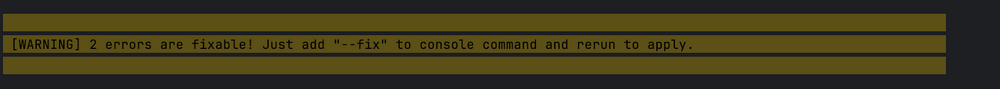
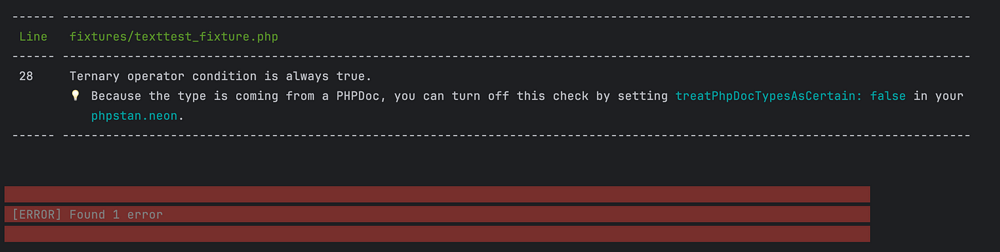
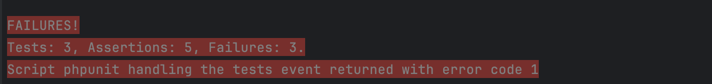
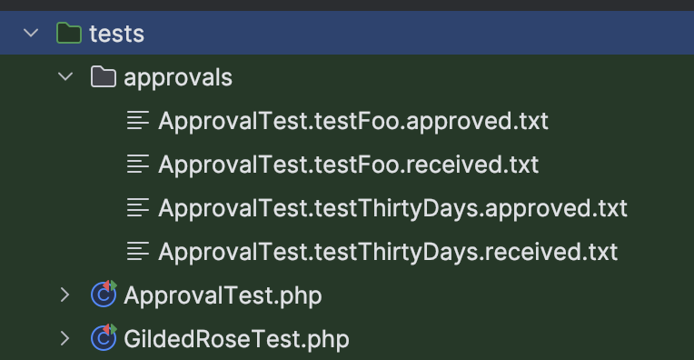
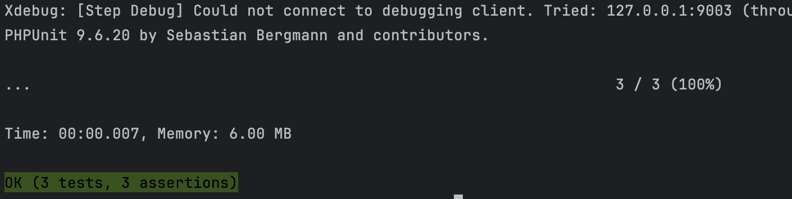
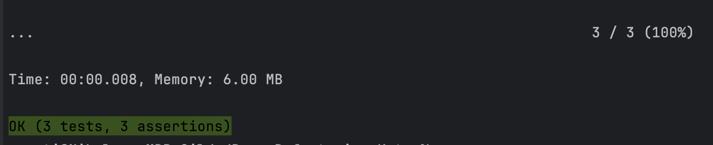
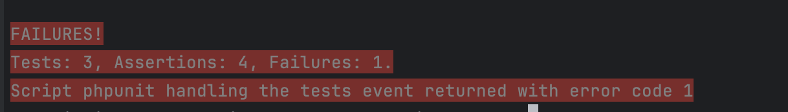
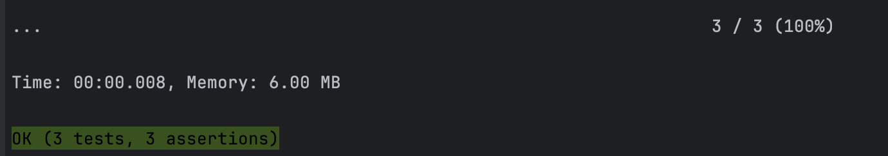

# GildedRose Refactoring Kata - PHP Version - Solution

## The Kata

In this repository, we'll dive into the old yet intriguing refactoring kata, **"Gilded Rose,"** and explore how to improve it in PHP.

You can find the kata's repository [here](https://github.com/emilybache/GildedRose-Refactoring-Kata).

### The original code for the kata:

```php
<?php

declare(strict_types=1);

namespace GildedRose;

class Item implements \Stringable
{
    public function __construct(
        public string $name,
        public int $sellIn,
        public int $quality
    ) {
    }

    public function __toString(): string
    {
        return (string) "{$this->name}, {$this->sellIn}, {$this->quality}";
    }
}
```

```php
<?php

declare(strict_types=1);

namespace GildedRose;

final class GildedRose
{
    /**
     * @param Item[] $items
     */
    public function __construct(
        private array $items
    ) {
    }

    public function updateQuality(): void
    {
        foreach ($this->items as $item) {
            if ($item->name != 'Aged Brie' and $item->name != 'Backstage passes to a TAFKAL80ETC concert') {
                if ($item->quality > 0) {
                    if ($item->name != 'Sulfuras, Hand of Ragnaros') {
                        $item->quality = $item->quality - 1;
                    }
                }
            } else {
                if ($item->quality < 50) {
                    $item->quality = $item->quality + 1;
                    if ($item->name == 'Backstage passes to a TAFKAL80ETC concert') {
                        if ($item->sellIn < 11) {
                            if ($item->quality < 50) {
                                $item->quality = $item->quality + 1;
                            }
                        }
                        if ($item->sellIn < 6) {
                            if ($item->quality < 50) {
                                $item->quality = $item->quality + 1;
                            }
                        }
                    }
                }
            }

            if ($item->name != 'Sulfuras, Hand of Ragnaros') {
                $item->sellIn = $item->sellIn - 1;
            }

            if ($item->sellIn < 0) {
                if ($item->name != 'Aged Brie') {
                    if ($item->name != 'Backstage passes to a TAFKAL80ETC concert') {
                        if ($item->quality > 0) {
                            if ($item->name != 'Sulfuras, Hand of Ragnaros') {
                                $item->quality = $item->quality - 1;
                            }
                        }
                    } else {
                        $item->quality = $item->quality - $item->quality;
                    }
                } else {
                    if ($item->quality < 50) {
                        $item->quality = $item->quality + 1;
                    }
                }
            }
        }
    }
}
```

## Understanding the Refactoring Goals

When refactoring, it's crucial to consider the following goals:

- **External Behavior Unchanged:** The code's external interfaces must remain the same.
- **Preserve Existing Tests:** Ensure that all existing tests pass. Extending tests is fine, but modifying them risks altering the logic.
- **Improve Extensibility:** The code should be easier to extend with new features without altering the core logic.
- **Enhance Readability and Testability:** Refactor to make the code more understandable and easier to test.

## Code Analysis

At first glance, the code appears complex with numerous if-else statements. This high cognitive complexity indicates that the code could benefit from refactoring. To enhance clarity and maintainability, we should aim to write code that is understandable both to others and to our future selves.

The main observation is that the `Item` class encapsulates properties that change based on specific criteria. Additionally, the items can vary over time, suggesting that the logic will need to be flexible to accommodate new or removed items.

## Choosing the Right Tools

As developers, we use code constructs like tools to solve problems, similar to how craftsmen use hammers and screwdrivers. Fortunately, experienced developers have established various design patterns over the years. One suitable pattern for this kata is the Strategy Pattern, which helps address two main concerns:
- **Adding or Removing Units:** We can add or remove items without altering the global logic.
- **Encapsulating Item-Specific Logic:** Each item's update logic is contained within its own class.

Let's start with the refactoring process.

## First Step

Before starting the refactoring process, it's important to understand the current state of the code. This includes reviewing the existing tests, coding style, and running static analysis.

### Check the Code

First, let's examine the current state of the code. We can start by checking the code style with the following command:

```bash
composer check-cs
```

This command shows two errors, which can be easily fixed using the CS Fixer.



Next, we run static analysis with:

```bash
composer phpstan
```

This command identifies one error, which can also be quickly resolved.



After fixing all the errors, we can proceed to check the tests.

### Unit Tests

To run the unit tests, execute the following command:

```bash
composer tests
```



All tests failed. This is normal because these unit tests work a bit differently than standard unit tests. I had to look into how the ApprovalTests library works myself.

### Brief Explanation of ApprovalTest.php

When you run the tests for the first time, the library generates new files in the `tests/approvals` folder:

- The `*.approved.txt` file is initially empty.
- The `*.received.txt` file contains the output generated by the test.



You need to manually verify the output in the `*.received.txt` file. If the output is correct, simply copy its content into the `*.approved.txt` file. From then on, whenever you run the tests, the library compares the generated output with the content of the `*.approved.txt` file. If they match, the test passes; if not, it indicates a problem.

### Regarding GildedRoseTest.php

It seems incomplete, which is why there's a string named `"fixme"`. You can change this to `"foo"` to make the test work, though it's a very simple and outdated test.

After making these changes and running the test command again, all tests should pass.



**Well done!** Now we can confidently begin the refactoring process, knowing that we have a stable starting point. We can continuously check to ensure that we haven't broken any logic along the way.

## The Refactoring Process

### The Item Class

Here is the `Item` class we start with:

```php
<?php

declare(strict_types=1);

namespace GildedRose;

class Item implements \Stringable
{
    public function __construct(
        public string $name,
        public int $sellIn,
        public int $quality
    ) {
    }

    public function __toString(): string
    {
        return (string) "{$this->name}, {$this->sellIn}, {$this->quality}";
    }
}
```

Since we shouldn't modify this class according to the kata's instructions, we'll leave it as is. Although adding setters could be beneficial for better encapsulation, it's not necessary for this task.

### The GildedRose Class

To apply the Strategy Pattern, we'll refactor the `GildedRose` class to use strategies for updating items.

### Strategy Interface

First, we need to pick a good name for our strategy. From looking at the `updateQuality` method, we see it changes both the `quality` and `sellIn` properties. This makes me think the method name might not be the best. Since we can't change the method name according to refactoring rules, we'll keep it as is. But a better name could be `updateItem`, in my opinion.

For the interface name, `UpdateStrategy` fits the logic we have. In PHP, it's common to use "Interface" as a suffix for interfaces, so we should call it `UpdateStrategyInterface`. Then, our concrete classes can be named `AgedBrieUpdateStrategy`, `BackstagePassUpdateStrategy`, and so on.

```php
<?php

declare(strict_types=1);

namespace GildedRose\UpdateStrategy;

use GildedRose\Item;

interface UpdateStrategyInterface
{
    public function update(Item $item): void;
}
```

The `update` method only requires the `Item` parameter because updates are based on the item's properties alone.

Now, we'll implement the concrete strategy classes for specific items:

**AgedBrieUpdateStrategy**

Let's implement the `AgedBrieUpdateStrategy` based on the given requirements and focus on the behavior specific to the "Aged Brie" item:

- Aged Brie increases in Quality as it gets older (i.e., as SellIn decreases).
- The Quality of an item is never more than 50.
- After the sell-by date (SellIn < 0), the Quality of Aged Brie increases twice as fast.

```php
<?php

declare(strict_types=1);

namespace GildedRose\UpdateStrategy;

use GildedRose\Item;

class AgedBrieUpdateStrategy implements UpdateStrategyInterface
{
    public function update(Item $item): void
    {
        if ($item->quality < 50) {
            $item->quality++;
        }

        $item->sellIn--;

        if ($item->sellIn < 0 && $item->quality < 50) {
            $item->quality++;
        }
    }
}
```

**BackstagePassUpdateStrategy**

Let's implement the `BackstagePassUpdateStrategy` based on the provided requirements and handle the following rules:

- Backstage passes get better in Quality as the SellIn date gets closer.
- Quality increases by 2 when there are 10 days or less, and by 3 when there are 5 days or less.
- Quality drops to 0 after the concert (i.e., when SellIn < 0).
- The Quality of an item is never more than 50.

```php
<?php

declare(strict_types=1);

namespace GildedRose\UpdateStrategy;

use GildedRose\Item;

class BackstagePassUpdateStrategy implements UpdateStrategyInterface
{
    public function update(Item $item): void
    {
        if ($item->sellIn > 0) {
            $item->quality++;

            if ($item->sellIn <= 10 && $item->quality < 50) {
                $item->quality++;
            }

            if ($item->sellIn <= 5 && $item->quality < 50) {
                $item->quality++;
            }
        } else {
            $item->quality = 0;
        }

        $item->sellIn--;

        if ($item->quality > 50) {
            $item->quality = 50;
        }
    }
}
```

**SulfurasUpdateStrategy**

For the item "Sulfuras, Hand of Ragnaros," the behavior is quite straightforward based on the requirements:

- "Sulfuras" is a legendary item, so it never decreases in Quality.
- Its Quality is always 80 and does not change.
- It also never has to be sold, meaning the SellIn value does not decrease.

Given these rules, the `SulfurasUpdateStrategy` can be implemented very simply since the item's properties should remain unchanged.

```php
<?php

declare(strict_types=1);

namespace GildedRose\UpdateStrategy;

use GildedRose\Item;

class SulfurasUpdateStrategy implements UpdateStrategyInterface
{
    public function update(Item $item): void
    {
        // No changes to Quality or SellIn, as Sulfuras is a legendary item.
    }
}
```

**DefaultUpdateStrategy**

Lastly, we have to implement a `DefaultUpdateStrategy` for items like "+5 Dexterity Vest," which are not explicitly defined in the special cases (Aged Brie, Backstage passes, Sulfuras, etc.) with the general rules provided in the Kata:

- Quality decreases by 1 each day.
- Once the SellIn value reaches 0 or below, Quality decreases twice as fast (by 2).
- The Quality of an item is never negative.
- The SellIn value decreases by 1 each day.
- The Quality of an item is never more than 50.

```php
<?php

declare(strict_types=1);

namespace GildedRose\UpdateStrategy;

use GildedRose\Item;

class DefaultUpdateStrategy implements UpdateStrategyInterface
{
    public function update(Item $item): void
    {
        $item->sellIn--;

        if ($item->sellIn >= 0) {
            $item->quality--;
        } else {
            $item->quality -= 2;
        }

        if ($item->quality < 0) {
            $item->quality = 0;
        }

        if ($item->quality > 50) {
            $item->quality = 50;
        }
    }
}
```

### Usage of the Update Strategies

With these strategies implemented, we can now refactor the `GildedRose` class:

```php
<?php

declare(strict_types=1);

namespace GildedRose;

use GildedRose\UpdateStrategy\AgedBrieUpdateStrategy;
use GildedRose\UpdateStrategy\BackstagePassUpdateStrategy;
use GildedRose\UpdateStrategy\DefaultUpdateStrategy;
use GildedRose\UpdateStrategy\SulfurasUpdateStrategy;

class GildedRose
{
    private array $strategies;

    public function __construct(
        private array $items,
        array $customStrategies = []
    ) {
        $defaultStrategies = [
            'Aged Brie' => new AgedBrieUpdateStrategy(),
            'Backstage passes to a TAFKAL80ETC concert' => new BackstagePassUpdateStrategy(),
            'Sulfuras, Hand of Ragnaros' => new SulfurasUpdateStrategy(),
            'default' => new DefaultUpdateStrategy(),
        ];

        $this->strategies = array_merge($defaultStrategies, $customStrategies);
    }

    public function updateQuality(): void
    {
        foreach ($this->items as $item) {
            $strategy = $this->strategies[$item->name] ?? $this->strategies['default'];
            $strategy->update($item);
        }
    }
}
```

## The Result

Let's compare the old and the new code:

### 1. Separation of Concerns:

**Old Code:**  
The `updateQuality` method in the `GildedRose` class contained complex logic with numerous if-else statements to handle different types of items. This made the method hard to read, maintain, and extend.

**Refactored Code:**  
The logic for updating items is separated into individual strategy classes (`AgedBrieUpdateStrategy`, `BackstagePassUpdateStrategy`, `SulfurasUpdateStrategy`, and `DefaultUpdateStrategy`). Each class encapsulates the update behavior for a specific type of item, following the Single Responsibility Principle. This makes the code easier to understand and modify.

### 2. Extensibility:

**Old Code:**  
Adding new item types or modifying the behavior for existing ones required modifying the `updateQuality` method, which risked introducing bugs and made the code less flexible.

**Refactored Code:**  
New item types or special behaviors can be accommodated by creating new strategy classes without changing the existing ones. The `GildedRose` class simply needs to be provided with the appropriate strategy for each item type. This makes the system more flexible and extensible.

### 3. Maintainability:

**Old Code:**  
The single method in `GildedRose` was lengthy and difficult to maintain. Every change to item behavior required digging through complex conditional logic.

**Refactored Code:**  
With strategies encapsulating the behavior for different item types, each strategy class is small, focused, and easier to test independently. Changes to item behavior are localized to specific strategy classes, reducing the risk of unintended side effects.

### 4. Readability:

**Old Code:**  
The `updateQuality` method was cluttered with conditional logic, making it hard to follow the flow of operations and understand the rules for different items.

**Refactored Code:**  
The logic is clearly separated into different classes, each responsible for a specific type of item. This improves readability and helps developers quickly understand how each item type should be updated.

### 5. Robustness:

**Old Code:**  
Handling all item types within a single method increased the likelihood of errors and made the codebase prone to bugs due to its complexity.

**Refactored Code:**  
Strategies ensure that each item's update logic is managed independently. This isolation reduces the risk of introducing bugs when changes are made and ensures that the update logic adheres strictly to the specified rules for each item type.

### 6. Customizability:

**Old Code:**  
Customizing the behavior of item updates required significant modifications to the core logic.

**Refactored Code:**  
The `GildedRose` class allows for custom strategies to be injected, providing flexibility for custom behavior while falling back on default strategies for unspecified items. This makes it easy to adapt or extend behavior as needed.


Running the tests again shows that the expected output remains unchanged.



## Adding the New Requirement: "Conjured" Items

Now that we've refactored the code, let's add the new requirement:

> "We have recently signed a supplier of conjured items. This requires an update to our system:  
> - 'Conjured' items degrade in Quality twice as fast as normal items."

### New Strategy for "Conjured" Items

Here's the new strategy for handling "Conjured" items:

```php
<?php

declare(strict_types=1);

namespace GildedRose\UpdateStrategy;

use GildedRose\Item;

class ConjuredUpdateStrategy implements UpdateStrategyInterface
{
    public function update(Item $item): void
    {
        $item->sellIn--;

        if ($item->sellIn >= 0) {
            $item->quality -= 2;  // Degrades twice as fast
        } else {
            // After sell-by date, degrade quality twice as fast
            $item->quality -= 4;
        }

        if ($item->quality < 0) {
            $item->quality = 0;
        }

        if ($item->quality > 50) {
            $item->quality = 50;
        }
    }
}
```

### Including the New Strategy

Since our refactored code is modular, adding new functionality is easy without altering the main logic. We just need to include the new strategy in the strategies array.

```php
<?php

$defaultStrategies = [
    'Aged Brie' => new AgedBrieUpdateStrategy(),
    'Backstage passes to a TAFKAL80ETC concert' => new BackstagePassUpdateStrategy(),
    'Sulfuras, Hand of Ragnaros' => new SulfurasUpdateStrategy(),
    'Conjured Mana Cake' => new ConjuredUpdateStrategy(),
    'default' => new DefaultUpdateStrategy(),
];
```

This achieves one of the primary goals of the refactoring: **making the code easier to extend with new features without changing the core logic**.

### Testing the New Feature

Now, we need to double-check that no tests were broken after adding the new logic. In the test fixtures, the "Conjured Mana Cake" item is included, but there was a comment indicating that it wasn't implemented yet. As a result, it was treated as a default item.

```php
$items = [
    new Item('+5 Dexterity Vest', 10, 20),
    new Item('Aged Brie', 2, 0),
    new Item('Elixir of the Mongoose', 5, 7),
    new Item('Sulfuras, Hand of Ragnaros', 0, 80),
    new Item('Sulfuras, Hand of Ragnaros', -1, 80),
    new Item('Backstage passes to a TAFKAL80ETC concert', 15, 20),
    new Item('Backstage passes to a TAFKAL80ETC concert', 10, 49),
    new Item('Backstage passes to a TAFKAL80ETC concert', 5, 49),
    // this conjured item does not work properly yet
    new Item('Conjured Mana Cake', 3, 6),
];
```

As expected, the tests failed. This happened because we now have specific logic for the "Conjured Mana Cake" item, which is different from the logic for the default items.



### Checking and Approving the Output

Now, let's check the `ApprovalTest.testThirtyDays.received.txt` file to see if the output of the updater meets our criteria. It looks good to me. If it does, copy the content from `ApprovalTest.testThirtyDays.received.txt` into `ApprovalTest.testThirtyDays.approved.txt` and run the test again.



Everything looks good now. Our new feature was implemented smoothly.

## Summary

The refactored code improves maintainability, readability, and flexibility by using the Strategy Pattern. Each item type has its own class for handling its specific behavior. This makes the code easier to understand, more adaptable to changes, and better organized, leading to a more manageable and sustainable codebase.

---

## Bonus

Now that we've completed the main refactoring, we can further improve the code by extracting the strategy management from the GildedRose class. This will enhance future maintainability and better separate concerns.

### Context Class

In the Strategy Pattern, the Context Class is responsible for holding a reference to a strategy object and delegating the execution of the algorithm to that strategy. Currently, the caller (GildedRose) is acting as the context class. To make the code more modular, we'll create a separate class for this role.

We should choose a name that reflects the action being performed. For example, `ItemUpdater` or `ItemUpdaterService` would work well. We'll use `ItemUpdater`:

```php
<?php

declare(strict_types=1);

namespace GildedRose\Service;

use GildedRose\Item;
use GildedRose\UpdateStrategy\AgedBrieUpdateStrategy;
use GildedRose\UpdateStrategy\BackstagePassUpdateStrategy;
use GildedRose\UpdateStrategy\ConjuredUpdateStrategy;
use GildedRose\UpdateStrategy\DefaultUpdateStrategy;
use GildedRose\UpdateStrategy\SulfurasUpdateStrategy;

class ItemUpdater
{
    private array $strategies;

    public function __construct(array $customStrategies = [])
    {
        $defaultStrategies = [
            'Aged Brie' => new AgedBrieUpdateStrategy(),
            'Backstage passes to a TAFKAL80ETC concert' => new BackstagePassUpdateStrategy(),
            'Sulfuras, Hand of Ragnaros' => new SulfurasUpdateStrategy(),
            'Conjured Mana Cake' => new ConjuredUpdateStrategy(),
            'default' => new DefaultUpdateStrategy(),
        ];

        $this->strategies = array_merge($defaultStrategies, $customStrategies);
    }

    public function updateItem(Item $item): void
    {
        $strategy = $this->strategies[$item->name] ?? $this->strategies['default'];
        $strategy->update($item);
    }
}
```

Now that we have a dedicated `ItemUpdater` class, we have different options for integrating it with `GildedRose`. The best approach would be to inject an already initialized `ItemUpdater` object into the `GildedRose` constructor. This would decouple the classes, allowing `GildedRose` to focus only on its core functionality without worrying about how items are updated. However, this would require changes to unit tests and could alter the class's external behavior.

To avoid changing the external behavior for now, we'll initialize the `ItemUpdater` directly within the `GildedRose` constructor. While this isn't the ideal solution due to the resulting tight coupling, it keeps the current behavior intact.

```php
<?php

declare(strict_types=1);

namespace GildedRose;

use GildedRose\Service\ItemUpdater;

class GildedRose
{
    private ItemUpdater $itemUpdater;

    public function __construct(
        private array $items,
        array $customStrategies = []
    ) {
        $this->itemUpdater = new ItemUpdater($customStrategies);
    }

    public function updateQuality(): void
    {
        foreach ($this->items as $item) {
            $this->itemUpdater->updateItem($item);
        }
    }
}
```

As we can see, the `GildedRose` class is now cleaner and more maintainable. By extracting the strategy logic into the `ItemUpdater` class, we only need to modify the context class when adding new update strategies, leaving `GildedRose` untouched. This refactoring has made the code more modular and easier to extend in the future. Well done!

Happy coding!
